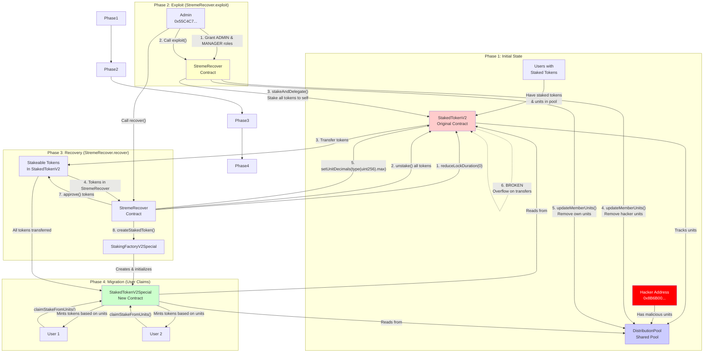
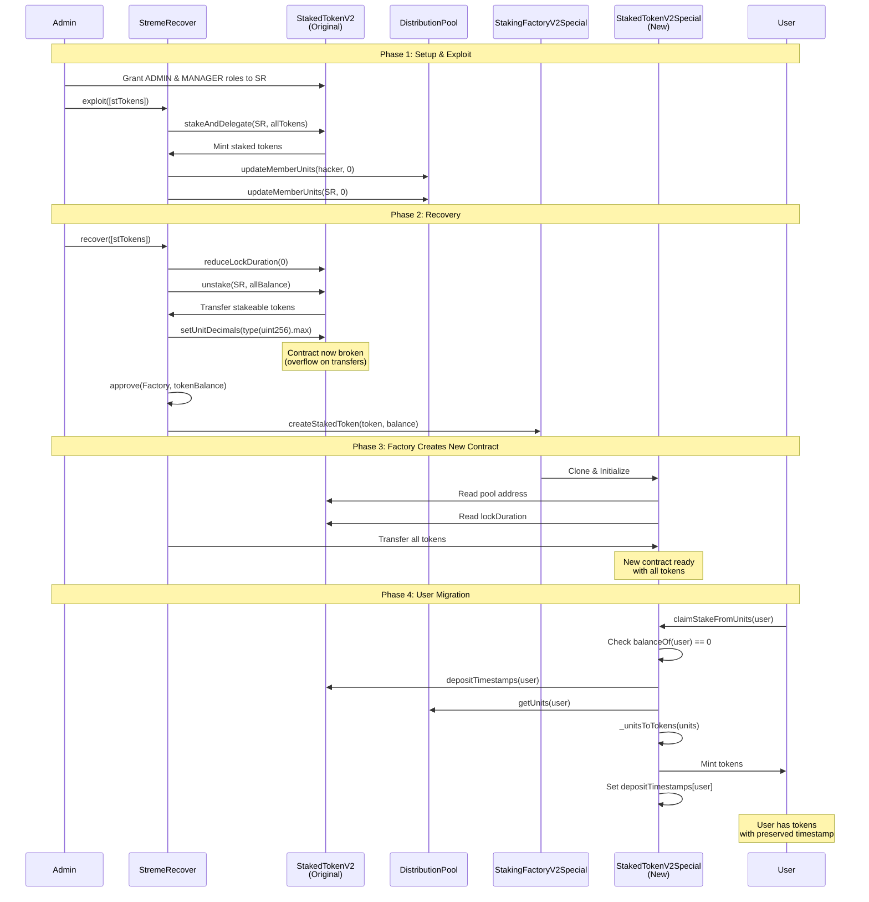
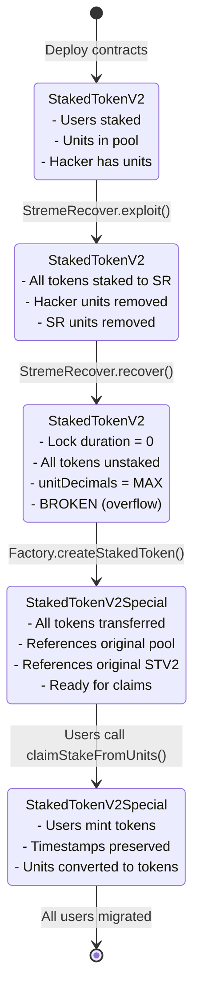
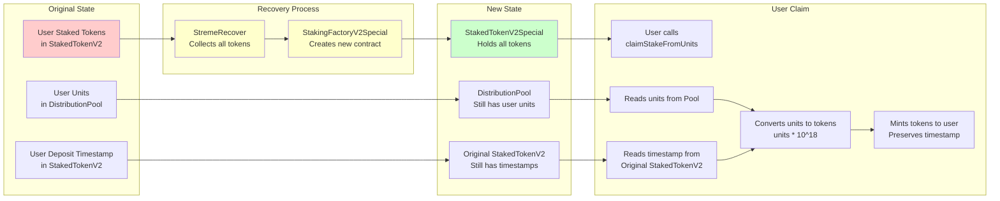

# White-Hack-Recover-Migration Process

## Overview Diagram

## Detailed Sequence Diagram

## State Transition Diagram

## Data Flow Diagram

## Key Operations Breakdown

### 1. Exploit Phase
- **Purpose**: Take control of all tokens and clean up malicious units
- **Actions**:
  1. Stake all tokens from StakedTokenV2 to StremeRecover
  2. Remove hacker's units from pool
  3. Remove StremeRecover's own units (so stakers get correct amount)

### 2. Recovery Phase
- **Purpose**: Extract tokens, break old contract, create new one
- **Actions**:
  1. Reduce lock duration to 0
  2. Unstake all tokens to StremeRecover
  3. Break original contract (set unitDecimals to max)
  4. Create new StakedTokenV2Special with all tokens

### 3. Migration Phase
- **Purpose**: Allow users to claim their tokens in new contract
- **Actions**:
  1. User calls `claimStakeFromUnits()`
  2. Contract reads user's units from shared pool
  3. Contract reads user's original deposit timestamp
  4. Contract mints tokens: `units * (10 ** unitDecimals)`
  5. Contract preserves original timestamp for lock calculations

## Critical Invariants

1. **Pool Units Preserved**: The DistributionPool still has all user units after recovery
2. **Timestamps Preserved**: Original StakedTokenV2 still has deposit timestamps (read-only)
3. **Token Conservation**: All tokens from original contract end up in new contract
4. **One-Time Claim**: Users can only claim once (balanceOf == 0 check)
5. **Unit Conversion**: `tokens = units * (10 ** unitDecimals)` where unitDecimals = 18

